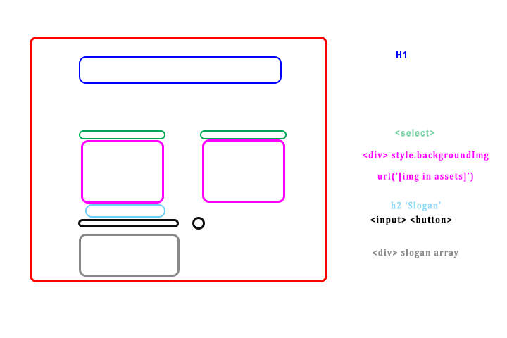

## City Builder README

HTML

-   h1

# Section 1

## Hero Slice

-   label: Hero
-   select: hero: batman/robin/mermaid man
-   div: background image set to hero (url)

## Arena Slice

-   label: Arena
-   select: arkhman city/ arkham asylum / chum bucket
-   div: background arena

## Villain Slice

-   label: Villain
-   select: Joker / Scarecrow / Plankton
-   div: background img of villain

# Section 2

## Voice Line

-   h2: voice line:
-   input: user input for voice line
-   button: submit voice line
-   p: area for voice line
-   div: number of times changed stats for hero/villain/arena (maybe scoreboard for fights)

# State

-   Hero Counter
-   Arena Counter
-   Villain Counter
-   Voice Line Array

# Events

-   Slogan button

1. User input is pushed into array of slogans

2. DOM for slogan area will be cleared

3. For loop to display slogans in DOM

4. append p elements to slogan div from the array

-   Select for Hero/Villain/Arena

1. event listener grabs value from select

2. increases counter for appropriate select

3. background image is set based on value (style.backgroundImage)

4. update the stats and display state changes to DOM
